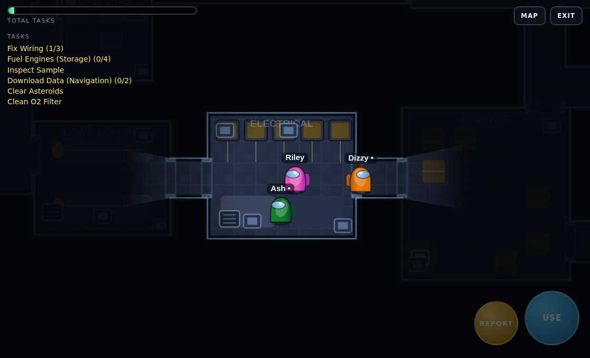
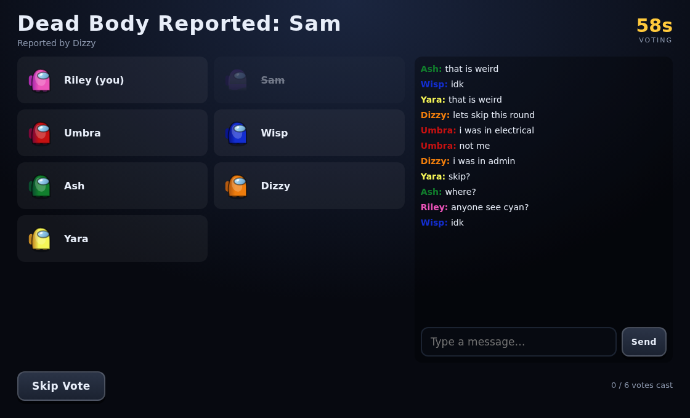
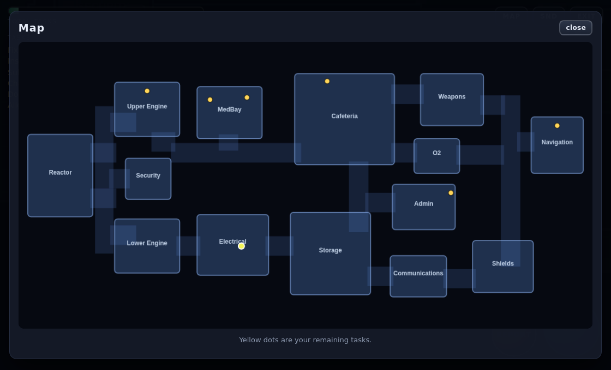
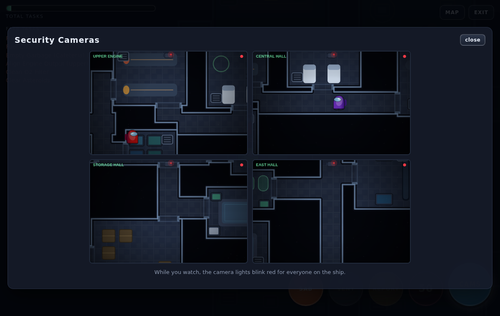
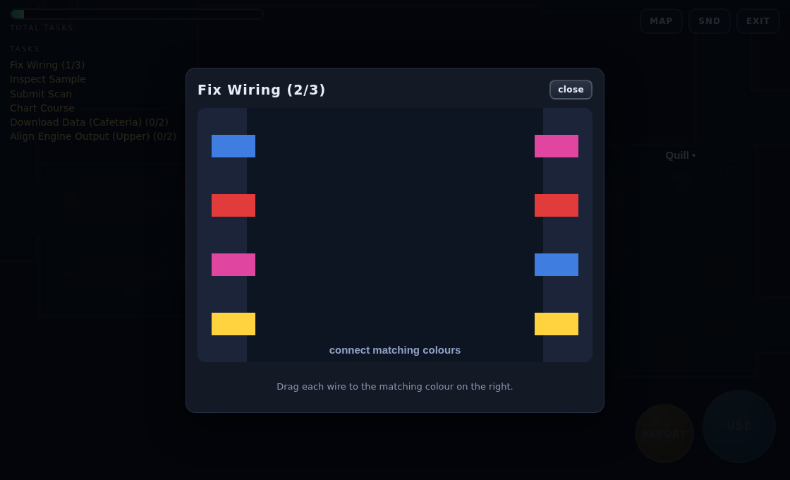
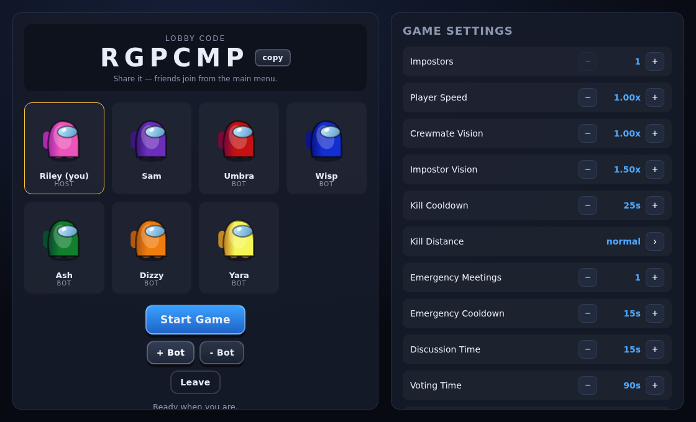

# Among Us — The Hull

A from-scratch recreation of *Among Us*: a real-time multiplayer social deduction game
that runs in any modern browser. Crewmates work through tasks on a spaceship while
Impostors pick them off, sabotage systems and lie about it in the meeting screen.

**Zero dependencies.** No game engine, no framework, no npm packages, no art assets —
the WebSocket server, the physics, the ship and every crewmate are implemented here in
plain JavaScript and drawn with the Canvas 2D API.



---

## Download and play (Windows)

Grab **AmongUs-TheHull-win-x64.zip** from the
[latest release](https://github.com/Ljbutton/AU/releases/latest), extract the whole
folder, and double-click **Play Among Us.bat**. Your browser opens the game; keep the
console window open while you play.

Nothing to install — the ZIP carries the official Node.js runtime with it. Friends on the
same network join using the `http://192.168.x.x:3000` address the console prints (allow
the Windows firewall prompt for node.exe on private networks), or add bots and play alone.

Rebuild that package yourself with `npm run build:win` — the build is reproducible, so
it reproduces the checksum published beside the download.

## Quick start (any OS)

```bash
git clone https://github.com/Ljbutton/AU.git
cd AU
npm start            # or: node server/index.js --open
```

Then open <http://localhost:3000>. `--open` launches your browser for you, and the server
steps to the next free port if 3000 is taken.

* Pick a name, one of twelve colours and one of ten hats — all drawn in code.
* **Host a Game** gives you a six-letter lobby code. Anyone on the same network can join
  from the main menu with that code.
* Short on humans? Press **+ Bot** — bots do tasks, report bodies, vote, and will happily
  murder you if they draw Impostor.
* Four players (humans or bots) are required to start; twelve is the maximum.

`PORT` and `HOST` environment variables override the defaults (`3000` / `0.0.0.0`).

---

## How to play

| Action | Keyboard | Touch |
| --- | --- | --- |
| Move | `W` `A` `S` `D` or arrow keys | drag anywhere to raise a joystick |
| Use a console | `E` or `Space` | **USE** |
| Report a body | `R` | **REPORT** |
| Kill (Impostor) | `Q` | **KILL** |
| Vent (Impostor) | `F` | **VENT** |
| Sabotage (Impostor) | — | **SAB** |
| Map / admin table | `Tab` or `M` | **MAP** |
| Security cameras | `E` at the console | **CAMS** |
| Focus meeting chat | `C` | tap the chat box |
| Close an overlay | `Esc` | **close** |

### Crewmates

Finish every task on the ship, or vote out every Impostor. Your task list is in the top
left; consoles you still need glow yellow on the floor and show as dots on the map. Tasks
are real minigames — wiring, keypads, memory sequences, aiming, dragging — not progress
bars you stand next to.

Dead crewmates become ghosts: you keep playing, you can still finish tasks (they count
towards the bar), you see the whole ship, and you get a chat channel the living cannot read.

### Impostors

You get a fake task list so your screen looks like everyone else's. You can:

* **Kill** — a cooldown-gated strike on anyone in range and line of sight.
* **Vent** — drop into the vent network and move between rooms unseen.
* **Sabotage** — cut the lights, kill comms, slam a room's doors, or start a reactor
  meltdown / oxygen leak that the crew must fix in 45 seconds or lose.

Fellow Impostors show up with their names in red.

### Meetings

Anyone alive can hit the emergency button in the Cafeteria, and finding a body lets you
report it. Both drag everyone into the meeting screen: discussion, then voting, then the
airlock. Ties skip. Ghosts watch but cannot vote.



---

## The ship

"The Hull" is an original 14-room map inspired by The Skeld.



Reactor · Upper Engine · Lower Engine · Security · MedBay · Electrical · Cafeteria ·
Storage · Admin · Weapons · O2 · Navigation · Shields · Communications.

It carries 11 vents in 5 networks, 25 sabotage-closable doors, and consoles for 17 task
types spread over 24 different minigames. Two information systems are worth knowing:

* **Admin table** — stand on it and open the map to see how many players are in each room.
* **Security cameras** — the console in Security shows four live feeds of the corridors.
  While anyone is watching, the camera lights blink red for the whole ship, so sitting on
  cameras is not free.

Cutting **Communications** disables both, and hides your task list and the task bar.



**Tasks** — Swipe Card, Fix Wiring, Calibrate Distributor, Chart Course, Clean O2 Filter,
Clear Asteroids, Prime Shields, Stabilize Steering, Unlock Manifolds, Align Engine Output,
Divert Power, Download Data, Empty Garbage, Fuel Engines, Inspect Sample, Start Reactor,
Submit Scan. Long tasks send you across several rooms; common tasks are identical for
every crewmate; visual tasks (scan, shields, asteroids) can be witnessed by other players.



---

## Lobby settings

The host can tune 17 options, all enforced server-side: impostor count, player speed,
crewmate and impostor vision, kill cooldown and distance, emergency meetings and their
cooldown, discussion and voting time, confirm ejects, visual tasks, anonymous votes, task
bar updates (always / meetings / never), and the number of common, long and short tasks.



---

## How it works

```
shared/       code that runs identically on the server and in the browser
  geom.js         segment raycasting, visibility polygons, circle-vs-wall resolution
  map.js          the ship: rooms, corridors, doors, vents, wall extraction, nav graph
  movement.js     the one movement implementation both sides use
  tasks.js        task catalogue, console placement, per-player assignment
  constants.js    tuning values, colours, settings and their sanitiser

server/
  index.js        static file host + websocket upgrade
  ws.js           a small RFC 6455 WebSocket server written for this project
  rooms.js        lobby registry and the 20 Hz simulation loop
  game.js         the authoritative game: roles, tasks, kills, sabotage, meetings, wins
  bots.js         AI players that act only through the same actions a human client sends

scripts/
  build-windows.mjs  packages the game + an official Node runtime into a ZIP
  zip.js             a small zip reader/writer, so packaging needs no npm either

public/
  index.html      every screen: menu, lobby, game, meeting, results
  js/render.js    ship, sprites, lighting, mini-map
  js/hud.js       contextual actions, task list, sabotage board
  js/screens.js   menu, lobby, meeting and end-screen UI
  js/minigames/   24 playable consoles
  js/sprites.js   procedural crewmates, ghosts and corpses
  js/sound.js     WebAudio synth — every sound is generated at runtime
```

A few decisions worth calling out:

**The map is a union of rectangles.** Rooms and corridors are axis-aligned rects, and the
ship's walls are *derived* from that union: for each rectangle edge, the stretches covered
by a neighbouring rectangle are subtracted, and what survives is the outline. Collision,
line of sight and rendering therefore all read from one source of truth, and a doorway is
simply where a corridor overlaps a room. `tests/run.js` flood-fills the walkable area to
prove every room is still reachable.

**The server is authoritative.** Clients send an input direction; the server integrates
movement, and each client predicts locally with the *same* `shared/movement.js` code and
eases towards the server position rather than snapping. Kills, task completion, votes and
sabotage fixes are all range-checked server-side — the client cannot complete a task from
across the ship, and a crewmate who asks to kill is ignored.

**Vision is computed twice, on purpose.** The server culls each snapshot to what that
player can actually see (distance + line of sight through walls and shut doors), so
another player's position never reaches a client that should not have it. The client then
draws a raycast visibility polygon for the same region, which is what produces the dark
ship and the light spilling through doorways.

**Game time is simulated, not wall-clock.** Every timer runs off an internal clock
advanced by the tick loop, which is what lets the test-suite play ten full rounds in a
couple of seconds.

---

## Tests

```bash
npm test
```

23 checks with no test framework: map reachability, doorway placement, console clearance,
every room-to-room path and every task console walked by a real collision-resolved walker
(including one that re-plans its route every tick, which is how doorway oscillation bugs
show up), random walkers that must never escape the ship, line of sight through open and
closed doors, settings sanitising, task assignment, and the game rules themselves
(crewmates cannot kill, impostors cannot kill through walls, task steps only count near
the console and only for crew, majority ejection and tie-skipping, ghosts cannot vote or
be seen, both reactor pads are required, an unfixed reactor loses the game, only impostors
sabotage and vent, cameras only work at the console and die with comms), finishing with
ten complete simulated rounds that must all reach a legal end state.

---

## Notes

This is a fan recreation built for fun and for learning; *Among Us* is made by
[Innersloth](https://www.innersloth.com/games/among-us/). No code or assets from the
original game are used here — buy the real thing, it's excellent.
